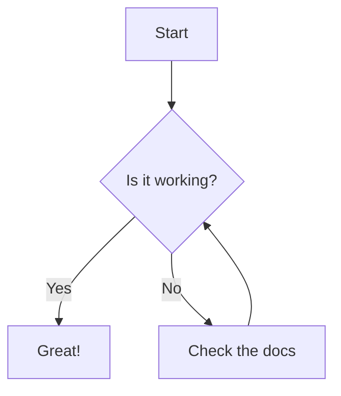

# Your First Mermaid Diagram

In this lab you will install the Mermaid CLI, write your first diagram in a plain text file, and render it to a PNG image. You will learn the core idea behind "diagrams as code" — keeping your diagrams in version control alongside the systems they describe.

**Prerequisites:** Node.js 18+ and npm installed. Basic familiarity with a terminal.

---

## Step 1 — What Is Mermaid and Why Use It?

Mermaid is a JavaScript-based diagramming library that turns plain text markup into SVG or PNG diagrams. Instead of dragging boxes around a GUI tool, you write declarations like `A --> B` and Mermaid renders the layout for you.

The big win is that diagram source lives in a text file you can commit to git, diff, review in a pull request, and regenerate at any time — no binary blobs, no "latest-final-v3.png" chaos.

Mermaid supports:

| Diagram type | Use case |
|---|---|
| Flowchart | Processes, decisions, data flow |
| Sequence | System interactions over time |
| Class | Object-oriented models |
| ER | Database schemas |
| C4 | Architecture overviews |
| Gantt | Project timelines |

> **Tip:** Mermaid diagrams also render natively in GitHub markdown, GitLab, Notion, Obsidian, and many other tools — you often don't need to export at all.

---

## Step 2 — Install the Mermaid CLI

The Mermaid CLI (`mmdc`) is the command-line renderer. Install it globally with npm:

```bash
npm install -g @mermaid-js/mermaid-cli
```

Verify the installation:

```bash
mmdc --version
```

Expected output (version number may differ):

```
10.9.1
```

> **Note:** If you see a permissions error on macOS/Linux, prefix with `sudo` or configure npm to install globals to your home directory.

---

## Step 3 — Write Your First Diagram File

Create a project directory and your first `.mmd` file:

```bash
mkdir mermaid-course && cd mermaid-course
```

Create the file `hello.mmd` with the following content:

```
graph TD
    A[Start] --> B{Is it working?}
    B -- Yes --> C[Great!]
    B -- No  --> D[Check the docs]
    D --> B
```

This is a **flowchart** (`graph TD` means top-down direction). Each line declares a node and an edge. Node labels go in `[]` for rectangles and `{}` for diamonds (decisions).

> **Why `.mmd`?** The `.mmd` extension is the conventional suffix for Mermaid source files. Some tools also use `.mermaid`.

---

## Step 4 — Render the Diagram to PNG

Use `mmdc` to render your diagram:

```bash
mmdc -i hello.mmd -o hello.png
```

Open the resulting `hello.png` in any image viewer or browser. You should see a top-down flowchart with a diamond decision node and a loop back to it.

Try rendering to SVG instead — SVG scales without quality loss and is better for documents:

```bash
mmdc -i hello.mmd -o hello.svg
```

| Flag | Meaning |
|---|---|
| `-i` | Input `.mmd` file |
| `-o` | Output file (extension determines format: `.png`, `.svg`, `.pdf`) |
| `-t` | Theme (`default`, `dark`, `forest`, `neutral`) |
| `-b` | Background colour (e.g. `transparent`, `#ffffff`) |

---

## Step 5 — Use the Mermaid Live Editor

The [Mermaid Live Editor](https://mermaid.live) lets you write and preview diagrams in the browser with no installation. It is excellent for quick prototyping.

Paste your `hello.mmd` content into the editor and watch it render in real time. Explore the **Config** panel — you can change the theme or override individual styles from there.

Copy the diagram URL from the **Share** button. The diagram source is encoded in the URL, so sharing the link shares the full source.

> **Tip:** Use the Live Editor when you're exploring a new diagram type. Once happy, paste the final source into your `.mmd` file and commit it.

---

## Step 6 — Embed a Diagram in a Markdown File

Mermaid diagrams can be embedded directly in GitHub-flavoured markdown using a fenced code block with the `mermaid` language tag.

Create `README.md`:

````markdown
# My Project

## Request Flow


````

Push this file to any GitHub repository and open it in the browser — GitHub renders the block as an interactive SVG automatically.

> **Local preview:** VS Code with the "Markdown Preview Mermaid Support" extension will render these blocks in the built-in preview pane.

---

## Step 7 — Checkpoint and What's Next

You have now:

- Installed the Mermaid CLI
- Written a flowchart in `.mmd` syntax
- Rendered it to PNG and SVG from the command line
- Embedded a diagram in a Markdown file

In the next module you will go deeper into **flowcharts** — learning how to model complex branching logic, subgraphs, and styling — then move on to **sequence diagrams** to capture how systems talk to each other over time.
