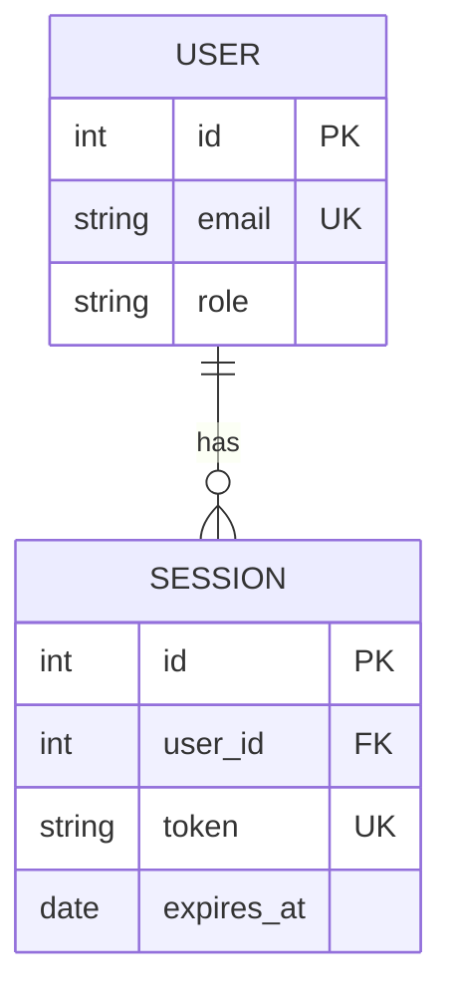
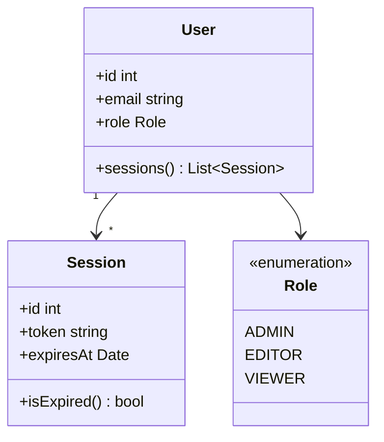

# Entity-Relationship and Class Diagrams

In this lab you will use Mermaid to produce structural models: an entity-relationship (ER) diagram for a relational database schema and a class diagram for an object-oriented design. These diagrams express *what things are and how they relate*, complementing the process and interaction diagrams from earlier modules.

**Prerequisites:** Labs 2-1 and 2-2 complete. Basic familiarity with relational databases and OOP concepts.

---

## Step 1 — ER Diagram Syntax

Mermaid ER diagrams use `erDiagram` as the keyword. Entities are named blocks and relationships are drawn between them with cardinality notation.

```
erDiagram
    CUSTOMER {
        int     id          PK
        string  name
        string  email       UK
        date    created_at
    }

    ORDER {
        int     id          PK
        int     customer_id FK
        date    placed_at
        string  status
    }

    CUSTOMER ||--o{ ORDER : "places"
```

Relationship syntax: `A <left-cardinality>--<right-cardinality> B : "label"`

| Symbol | Meaning |
|---|---|
| `\|o` | Zero or one |
| `\|\|` | Exactly one |
| `o{` | Zero or many |
| `\|{` | One or many |

> **Why ER diagrams in code?** Schema changes are reviewed in pull requests. An ER diagram in the PR description that regenerates from source gives reviewers an instant visual of what changed without needing access to a running database.

Create `customers.mmd` with the snippet above and render it:

```bash
mmdc -i customers.mmd -o customers.svg
```

---

## Step 2 — Model a Full E-Commerce Schema

Extend the schema to cover a realistic e-commerce domain with products, line items, addresses, and payments.

Create `ecommerce-er.mmd`:

```
erDiagram
    CUSTOMER {
        int     id          PK
        string  name
        string  email       UK
    }

    ADDRESS {
        int     id          PK
        int     customer_id FK
        string  line1
        string  city
        string  country
        boolean is_default
    }

    ORDER {
        int     id          PK
        int     customer_id FK
        int     address_id  FK
        date    placed_at
        string  status
    }

    ORDER_LINE {
        int     id          PK
        int     order_id    FK
        int     product_id  FK
        int     quantity
        decimal unit_price
    }

    PRODUCT {
        int     id          PK
        string  sku         UK
        string  name
        decimal price
        int     stock
    }

    PAYMENT {
        int     id          PK
        int     order_id    FK
        string  method
        decimal amount
        string  status
        date    processed_at
    }

    CUSTOMER ||--o{ ADDRESS     : "has"
    CUSTOMER ||--o{ ORDER       : "places"
    ORDER    }o--||  ADDRESS    : "ships to"
    ORDER    ||--|{ ORDER_LINE  : "contains"
    PRODUCT  ||--o{ ORDER_LINE  : "appears in"
    ORDER    ||--o{ PAYMENT     : "paid via"
```

```bash
mmdc -i ecommerce-er.mmd -o ecommerce-er.svg
```

---

## Step 3 — Class Diagram Syntax

Class diagrams model the structure of object-oriented code. They are useful for documenting domain models, showing inheritance hierarchies, and communicating design patterns.

```
classDiagram
    class Animal {
        +String name
        +int age
        +makeSound() void
    }

    class Dog {
        +String breed
        +fetch() void
    }

    class Cat {
        +bool indoor
        +purr() void
    }

    Animal <|-- Dog : extends
    Animal <|-- Cat : extends
```

Visibility modifiers:

| Symbol | Visibility |
|---|---|
| `+` | Public |
| `-` | Private |
| `#` | Protected |
| `~` | Package / internal |

```bash
mmdc -i animals.mmd -o animals.svg
```

---

## Step 4 — Model a Domain with Interfaces and Composition

Create `payment-domain.mmd` to model a payment processing domain using interfaces, abstract classes, and composition:

```
classDiagram
    class PaymentProcessor {
        <<interface>>
        +charge(amount float) Result
        +refund(txId string) Result
    }

    class StripeProcessor {
        -apiKey string
        +charge(amount float) Result
        +refund(txId string) Result
        -buildHeaders() map
    }

    class PayPalProcessor {
        -clientId string
        -secret string
        +charge(amount float) Result
        +refund(txId string) Result
    }

    class Order {
        +id int
        +total float
        +status string
        +process(p PaymentProcessor) void
    }

    class Result {
        +success bool
        +transactionId string
        +errorMessage string
    }

    PaymentProcessor <|.. StripeProcessor  : implements
    PaymentProcessor <|.. PayPalProcessor  : implements
    Order            --> PaymentProcessor  : uses
    Order            *-- Result            : produces
```

```bash
mmdc -i payment-domain.mmd -o payment-domain.svg
```

> **Relationship types in class diagrams:**
> - `<|--` Inheritance (is-a)
> - `<|..` Realisation / implements
> - `-->` Association (uses)
> - `*--` Composition (owns, lifecycle tied)
> - `o--` Aggregation (has, independent lifecycle)

---

## Step 5 — Add Notes and Generics

Mermaid class diagrams support generic type parameters and notes attached to classes:

```
classDiagram
    class Repository~T~ {
        <<interface>>
        +findById(id int) T
        +findAll() List~T~
        +save(entity T) void
        +delete(id int) void
    }

    class UserRepository {
        -db Database
        +findById(id int) User
        +findAll() List~User~
        +findByEmail(email string) User
        +save(entity User) void
        +delete(id int) void
    }

    class User {
        +id int
        +email string
        +passwordHash string
    }

    Repository~T~ <|.. UserRepository : implements
    UserRepository --> User

    note for UserRepository "findByEmail uses a unique index;\nadd to query plan if adding columns"
```

```bash
mmdc -i generics.mmd -o generics.svg
```

The `note for ClassName "text"` directive attaches a sticky-note to a class — good for recording constraints, non-obvious invariants, or performance notes directly on the diagram.

---

## Step 6 — Combine ER and Class Views in a README

A mature project often includes both an ER diagram (what the database looks like) and a class diagram (how the application models those entities) side by side.

Create `model-readme.md` that embeds both:

````markdown
# Data Model

## Database Schema



## Application Domain Model


````

```bash
mmdc -i model-readme.md -o model-readme-er.svg --input-format md
```

---

## Step 7 — Checkpoint and What's Next

You now have a complete structural diagramming toolkit:

- ER diagrams with cardinality, PKs, FKs, and unique keys
- Class diagrams with visibility, interfaces, generics, and all relationship types
- Inline notes for capturing invariants and constraints

In the final lab you will combine everything into **C4 architecture diagrams** — Mermaid's highest-level diagram type for communicating system context, containers, and components to both technical and non-technical audiences.
