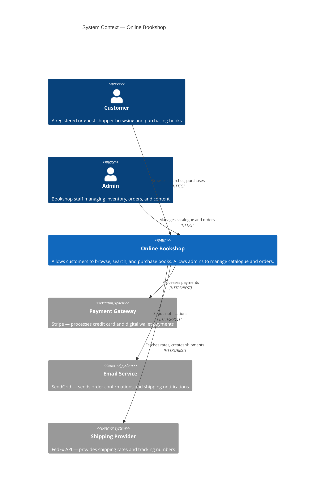
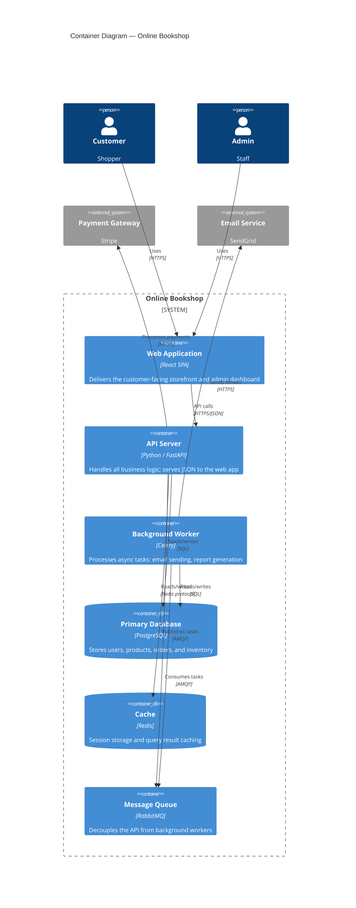
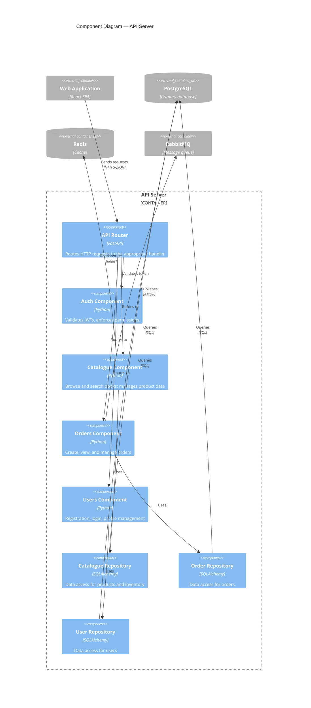

# Drawing Architecture Diagrams with the C4 Model

In this lab you will learn why most architecture diagrams fail to communicate, master the **C4 model** — the clearest diagramming approach in the industry — and produce a real set of C4 diagrams for the Online Bookshop system using Mermaid, a text-based diagramming language that lives in your repository alongside your code.

**Prerequisites:** Lab 2-2 completed; `arch-journal/` directory exists. VS Code with the Mermaid Preview extension recommended (`bierner.markdown-mermaid`).

---

## Step 1 — Why Most Architecture Diagrams Fail

You will encounter a lot of architecture diagrams in your career. Most of them are useless. Here is why:

```
Common diagram failures:
──────────────────────────────────────────────────────────────────
No legend          — boxes and arrows with no explanation of what they mean
Wrong audience     — a diagram for a CTO looks nothing like one for a developer
Too much detail    — everything on one page; impossible to parse
Too little detail  — so abstract it tells you nothing actionable
Stale              — drawn once, never updated, now wrong
```

The fundamental problem: a box labelled "Service" could mean a Docker container, a logical module, a physical server, or a microservice — all in the same diagram, with no indication of which.

The **C4 model**, created by Simon Brown, solves this with a simple idea: **use four levels of zoom**, each with a clear and agreed definition. Readers know exactly what level they are looking at and what each box means.

```bash
cd arch-journal
cat > c4-diagram.md << 'EOF'
# C4 Architecture Diagrams — Online Bookshop

## About This Document
These diagrams use the C4 model (Context, Containers, Components, Code).
Each level zooms into the previous one.
Diagrams are written in Mermaid for version control friendliness.

EOF
```

---

## Step 2 — The Four Levels of C4

```
Level 1 — System Context
  Zoom: 30,000 feet
  Shows: Your system + external actors and systems it interacts with
  Audience: Everyone — technical and non-technical
  Question answered: "What does this system do and who uses it?"

Level 2 — Container Diagram
  Zoom: 10,000 feet
  Shows: Deployable units inside your system (web app, API, database, queue)
  Audience: Technical team
  Question answered: "What are the main technical building blocks?"

Level 3 — Component Diagram
  Zoom: 1,000 feet
  Shows: Major components inside one container
  Audience: Developers working on that container
  Question answered: "How is this container structured internally?"

Level 4 — Code Diagram
  Zoom: ground level
  Shows: Classes, interfaces, functions
  Audience: Individual developer
  Question answered: "How is this component implemented?"
  Note: Usually auto-generated from code; rarely drawn manually
```

> **You will use levels 1, 2, and 3 most often.** Level 4 is usually skipped — the code itself is the diagram at that level of detail. The sweet spot for team communication is Levels 1 and 2.

C4 uses a small set of deliberately limited shapes:

| Shape | Meaning |
|-------|---------|
| Person | A human user or role |
| System | A software system (your system or an external one) |
| Container | A deployable unit: web app, API, mobile app, database, queue |
| Component | A logical grouping of code within a container |

---

## Step 3 — Level 1: System Context Diagram

The Context diagram shows your system as a single box and everything it interacts with around it. No internal details at this level.

```bash
cat >> c4-diagram.md << 'EOF'

## Level 1 — System Context


EOF
```

Open `c4-diagram.md` in VS Code with the Mermaid preview to see the rendered diagram.

> **What to notice:** The Online Bookshop is treated as a black box here. We are not explaining *how* it works — only *what* it does and *who* it interacts with. A non-technical stakeholder can read this diagram and immediately understand the system's boundaries.

---

## Step 4 — Level 2: Container Diagram

The Container diagram zooms into the Online Bookshop box and shows the deployable units inside it.

```bash
cat >> c4-diagram.md << 'EOF'

## Level 2 — Container Diagram


EOF
```

> **What to notice:** Every box is a *deployable unit* — something you could independently scale, restart, or replace. The technology choice is explicitly labelled (FastAPI, PostgreSQL, Redis). A developer joining the team can now understand the tech stack from a single diagram.

---

## Step 5 — Level 3: Component Diagram

The Component diagram zooms into one container — the API Server — and shows its internal logical structure.

```bash
cat >> c4-diagram.md << 'EOF'

## Level 3 — Component Diagram (API Server)


EOF
```

Notice how this diagram reflects the layered architecture from Lab 2-1: Router (Presentation) → Components (Business Logic) → Repositories (Data Access).

---

## Step 6 — Diagram Review Checklist

A good C4 diagram passes this checklist:

```bash
cat >> c4-diagram.md << 'EOF'

## Diagram Review Checklist

### For every diagram:
- [ ] Title clearly states the level (Context / Container / Component) and system name
- [ ] Every box has a label, technology, and short description
- [ ] Every arrow has a label describing what flows and how (protocol)
- [ ] External systems are visually distinct from internal ones
- [ ] The diagram fits on one screen without scrolling

### Context diagram:
- [ ] The system under design is clearly identified
- [ ] All human users are shown as Person shapes
- [ ] All external systems are shown and labelled
- [ ] A non-technical stakeholder could read this without help

### Container diagram:
- [ ] Every deployable unit is its own container box
- [ ] Databases and message queues are shown separately from services
- [ ] Technology choices are labelled on each container
- [ ] The diagram could be used to brief a new DevOps engineer

### Component diagram:
- [ ] The boundaries match the layered architecture (if applicable)
- [ ] No component crosses layer boundaries unexpectedly
- [ ] The diagram could guide a new developer to the right file for any change

## What I Would Add Next
If I were to extend these diagrams for the bookshop:
-
-
EOF
```

```bash
cat c4-diagram.md
```

In the final lab you will learn how to write **Architecture Decision Records** — the written documents that preserve the *why* behind every diagram — and understand your growing role in shaping architecture as you progress in your career.
