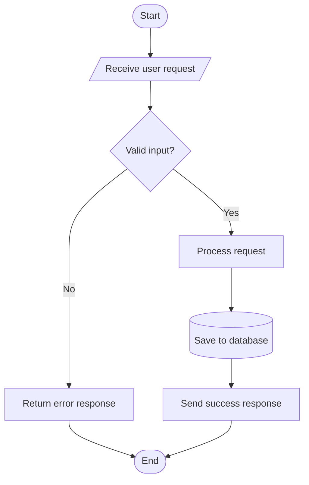

# Request Handling Flowchart

```mermaid
flowchart TD
    Start([Start]) --> Input[/Receive user request/]
    Input --> Validate{Valid input?}

    Validate -- No --> Error[Return error response]
    Error --> End

    Validate -- Yes --> Process[Process request]
    Process --> DB[(Save to database)]
    DB --> Respond[Send success response]
    Respond --> End([End])
```
